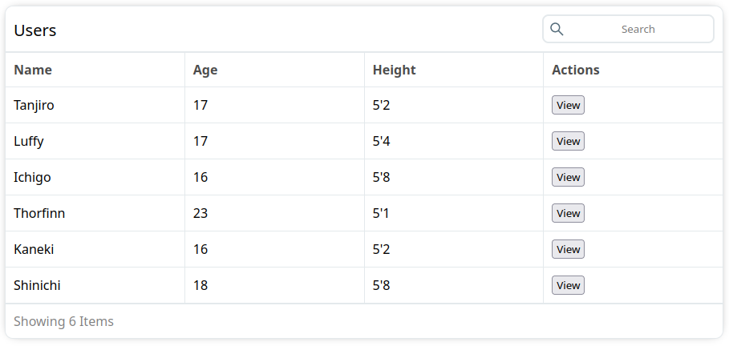

# EasyTable: Simplify Table Management in React

EasyTable is a versatile React library designed to streamline the process of creating and managing tables within your web applications. Whether you're building a data-rich dashboard, a product catalog, or any application that requires organized data presentation, EasyTable empowers you with intuitive tools to handle complex table structures with ease.

## Key Features:

✨ **Effortless Integration:** Seamlessly integrate EasyTable into your React projects using a simple component, minimizing the learning curve and enabling rapid implementation.

🔍 **Smart Search:** Implement advanced search functionalities across multiple columns, providing users with the ability to quickly find specific data points without hassle.

🎛️ **Customizable Design:** Tailor the look and feel of your tables to match your application's aesthetics. Customize headers, rows, and cells to maintain consistent branding.

🚀 **Performance Optimized:** With an emphasis on performance, EasyTable efficiently handles large datasets, utilizing smart rendering techniques to ensure smooth user experiences.

<!-- 💡 Intuitive Sorting: Allow users to sort table columns in ascending or descending order, making data exploration more intuitive and user-friendly. -->

<!-- 📊 Data Visualization: Integrate data visualization components seamlessly within table cells, presenting information using charts, icons, or any other React component. -->

<!-- 🔄 Pagination and Infinite Scrolling: Implement pagination or infinite scrolling to manage data presentation, ensuring efficient navigation through extensive datasets.

📋 Clipboard Interaction: Enable easy data copying with built-in clipboard interaction support, allowing users to extract table data effortlessly. -->


## Getting Started:

1. Install EasyTable using your preferred package manager:

    ```sh
    npm install easytable
    ```

2. A Simple Code Example 
    ```javascript
    import React from 'react';
    import EazyTable from 'eazytable';
    import 'eazytable/dist/eazytable.css';


    const tempData = [
        { name: "Tanjiro", age: 17, height: "5'2", id: 1 },
        { name: "Luffy", age: 17, height: "5'4", id: 2 },
        { name: "Ichigo", age: 16, height: "5'8", id: 3 },
        { name: "Thorfinn", age: 23, height: "5'1", id: 4 },
        { name: "Kaneki", age: 16, height: "5'2", id: 5 },
        { name: "Shinichi", age: 18, height: "5'8", id: 6 }
    ]

    const columns = [
        // Column Declarations to display from the datasets
        { field: 'name', label: "Name", width: 200 },
        { field: 'age', label: "Age", width: 200 },
        { field: 'height', label: "Height", width: 200 },
        // Custom Field
        {
            field: 'actions',
            width: 200,
            label: "Actions", render: (row) => {
                return <button onClick={() => alert(row.id)}>View</button>
            }
        }
    ]

    const Table = () => {
        return (
            <EazyTable
                title="Users"
                columns={columns}
                data={tempData}
                rowKeyField="id"
            />
        );
    };

    export default Table;
    ```

3. You're good to go! Let's run the code!

    


<!-- interface EazyTableProps {
    title: string;
    columns: Array<ColumnType>;
    data: Array<RowType>;
    rowKeyField: string;
    theme?: string;
    customClass?: string;
    showHeader?: boolean;
    showFooter?: boolean;
} -->

## Props References

### EazyTable Props

|Prop        |Type       | Required    | Description    |
|------------|-----------|-------------|----------------|
| title     | String | true |  Set the Title of the table|
| columns   | Array  | true |  An Array Containing a list of columns|
| data   | Array  | true |  An array containting row data |
| rowKeyField | Number | The field in `data` which contains a unique row key |
| showHeader | Boolean |  |
| showFooter | Boolean |  |
| height    | String | Set a fixed height for the table |
| alignText    | String | Set the alignment of text in the table |
| striped    | String | Enable stripes for rows  |


### Column

| Key        |Type          |Required | Description    |
|------------|--------------|---------|----------------|
| title     | String | true | Name of the column|
| label   | String  | true | An Array Containing a list of columns|
| width   | Number  | false | Set the column width|
| render   | Component  | false |  First argument will have a paramenter called `row`  |